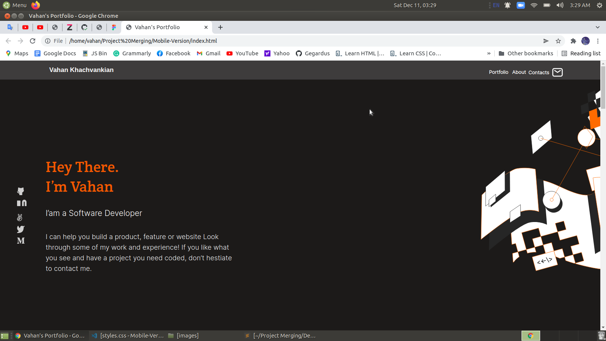
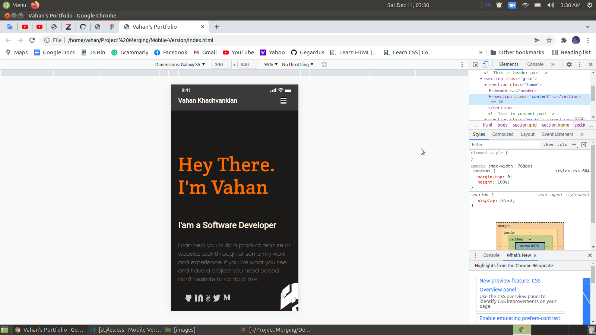

# Desktop Version

for the Setup-and-mobile-version-skeleton project

> This is my first portfolio project in Microverse curriculum.

## Built With

- HTML
- CSS

## Live Demo

[Live Demo Link](https://gegardus.github.io/Desktop-Version/)

## Getting Started

To get a local copy, clone from the link below.

https://github.com/Gegardus/Desktop-Version/tree/desktop

## Author

Vahan Khachvankian

- GitHub: https://github.com/Gegardus

## 📝 License

This project is [MIT](./MIT.md) licensed.
